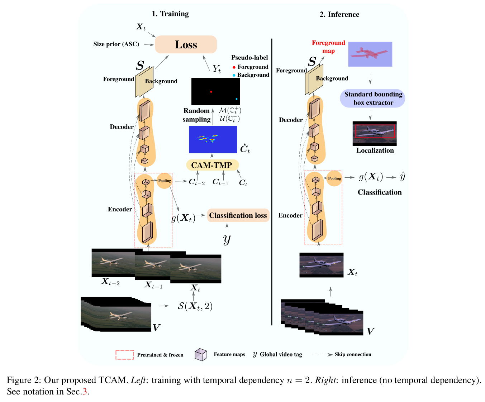
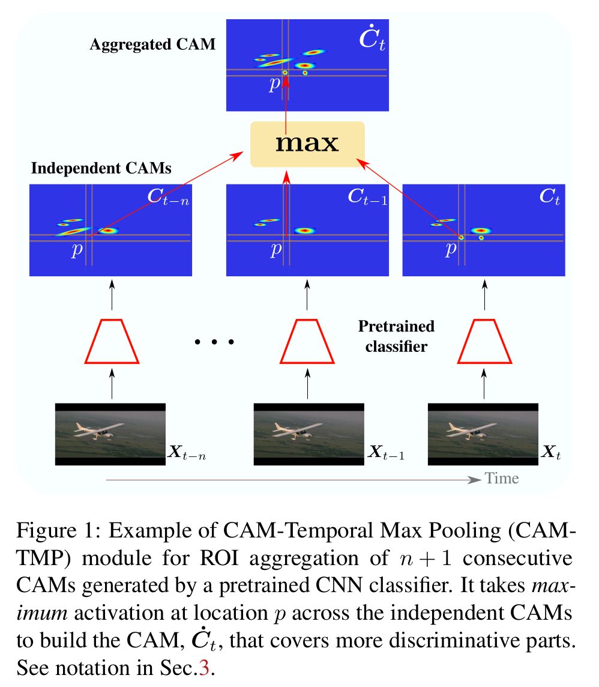
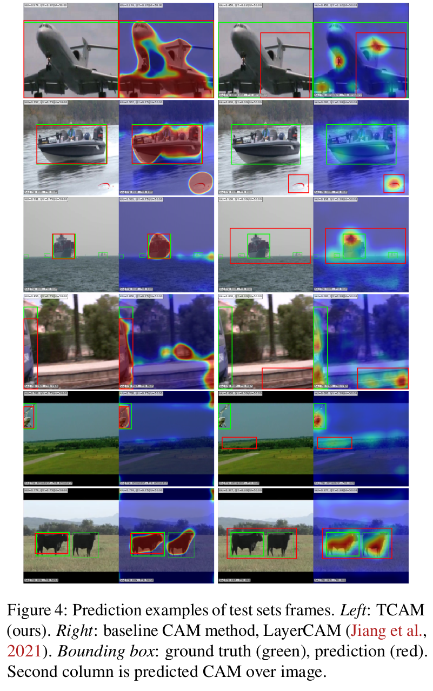

### Pytorch 1.11.0 code for:
`TCAM: Temporal Class Activation Maps for Object Localization in
Weakly-Labeled Unconstrained Videos`([https://arxiv.
org/abs/2201.02445](https://arxiv.org/abs/2201.02445))

### Citation:
```
@article{tcamsbelharbi2022,
  title={TCAM: Temporal Class Activation Maps for Object Localization in
Weakly-Labeled Unconstrained Videos},
  author={Belharbi, S. and Ben Ayed, I. and McCaffrey, L. and Granger, E.},
  journal={CoRR},
  volume={abs/1909.03354},
}
```

### Issues:
Please create a github issue.

### Content:
* [Method](#method)
* [Results](#results)
* [Requirements](#re2q)
* [Datasets](#datasets)
* [Run code](#run)
* [Localization performance](#locperf)
* [Required changes from your side](#changes)


#### <a name='method'> Method</a>:




#### <a name='results'> Results</a>:


https://user-images.githubusercontent.com/23446793/187315553-29a4999e-e2e6-4992-9d03-17a335b0f9ee.mp4

https://user-images.githubusercontent.com/23446793/187315693-fca706f7-eaa1-4530-993d-654233e49fd0.mp4


https://user-images.githubusercontent.com/23446793/187315676-93e4bbb6-4e7c-4cb1-afe9-8cd395e5126b.mp4


https://user-images.githubusercontent.com/23446793/187315661-8f15f290-6938-4092-8b30-7c210e896a39.mp4

hubusercontent.com/23446793/187315583-40b0a4ae-4705-47c9-b7e6-f6b42dee4d1d.mp4


https://user-images.githubusercontent.com/23446793/187315646-362762aa-afe1-4cc4-a59f-833432d090b7.mp4


https://user-images.githubusercontent.com/23446793/187315634-196d046b-db20-4ef3-a7ec-215f96dc32e0.mp4


https://user-images.githubusercontent.com/23446793/187315618-22679997-089f-4ff3-a816-a56ccfc664fa.mp4


https://user-images.githubusercontent.com/23446793/187315596-f50b9179-018c-4cbd-9221-5828b2fbf9f2.mp4


https://user-images.githubusercontent.com/23446793/187313856-50ee9585-040d-4ea8-b747-f5109f9da1eb.mp4


https://user-images.githubusercontent.com/23446793/187315768-a0e525f4-5faf-4a38-8060-78d4417828c2.mp4


https://user-images.githubusercontent.com/23446793/187315784-67421f6a-642b-4df5-b003-6e011b257f77.mp4


https://user-images.githubusercontent.com/23446793/187315802-d4a36478-55ac-4ad2-ab26-96139455c7e0.mp4


https://user-images.githubusercontent.com/23446793/187315872-55d44fbd-d72b-4d45-8056-174edc9b4832.mp4


https://user-images.githubusercontent.com/23446793/187315890-493df6fc-52a5-4975-b6fd-f77dde069737.mp4


https://user-images.githubusercontent.com/23446793/187315967-4b6452a8-5938-4a5a-b852-275f0c825e18.mp4


https://user-images.githubusercontent.com/23446793/187316026-6f50bc4a-c034-457f-af5a-3b8d38797647.mp4


https://user-images.githubusercontent.com/23446793/187316070-28e5b302-8e46-4435-9bfb-30fd3e05a743.mp4


https://user-images.githubusercontent.com/23446793/187316085-a861ad67-25ce-4d1a-889d-27a8db5256a3.mp4


https://user-images.githubusercontent.com/23446793/187316093-8dd2e973-43e7-4ccd-a0b2-fd39010ce194.mp4


https://user-images.githubusercontent.com/23446793/187316108-02c738b6-5169-4e7b-8afd-02d54d0dc49d.mp4





#### <a name='reqs'> Requirements</a>:

See full requirements at [./dependencies/requirements.txt](./dependencies/requirements.txt)

* Python 3.7.10
* [Pytorch](https://github.com/pytorch/pytorch)  1.11.0
* [torchvision](https://github.com/pytorch/vision) 0.12.0
* [Full dependencies](dependencies/requirements.txt)
* Build and install CRF:
    * Install [Swig](http://www.swig.org/index.php)
    * CRF
```shell
cdir=$(pwd)
cd dlib/crf/crfwrapper/bilateralfilter
swig -python -c++ bilateralfilter.i
python setup.py install
cd $cdir
cd dlib/crf/crfwrapper/colorbilateralfilter
swig -python -c++ colorbilateralfilter.i
python setup.py install
```

#### <a name="datasets"> Download datasets </a>:
See [folds/wsol-done-right-splits/dataset-scripts](
folds/wsol-done-right-splits/dataset-scripts). For more details, see
[wsol-done-right](https://github.com/clovaai/wsolevaluation) repo.

You can use these scripts to download the datasets: [cmds](./cmds). Use the
script [_video_ds_ytov2_2.py](./dlib/datasets/_video_ds_ytov2_2.py) to
reformat YTOv2.2.

Once you download the datasets, you need to adjust the paths in
[get_root_wsol_dataset()](dlib/configure/config.py).

#### <a name="datasets"> Run code </a>:
Download files in `download-files.txt` from google drive.

1. WSOL baselines: CAM over YouTube-Objects-v1.0 using ResNet50:
```shell
cudaid=0  # cudaid=$1
export CUDA_VISIBLE_DEVICES=$cudaid

getfreeport() {
freeport=$(python -c 'import socket; s=socket.socket(); s.bind(("", 0)); print(s.getsockname()[1]); s.close()')
}
export OMP_NUM_THREADS=50
export NCCL_BLOCKING_WAIT=1
plaunch=$(python -c "from os import path; import torch; print(path.join(path.dirname(torch.__file__), 'distributed', 'launch.py'))")
getfreeport
torchrun --nnodes=1 --node_rank=0 --nproc_per_node=1 --master_port=$freeport main.py --local_world_size=1 \
       --task STD_CL \
       --encoder_name resnet50 \
       --arch STDClassifier \
       --opt__name_optimizer sgd \
       --dist_backend gloo \
       --batch_size 32 \
       --max_epochs 100 \
       --checkpoint_save 100 \
       --keep_last_n_checkpoints 10 \
       --freeze_cl False \
       --freeze_encoder False \
       --support_background True \
       --method CAM \
       --spatial_pooling WGAP \
       --dataset YouTube-Objects-v1.0 \
       --box_v2_metric False \
       --cudaid $cudaid \
       --amp True \
       --plot_tr_cam_progress False \
       --opt__lr 0.001 \
       --opt__step_size 15 \
       --opt__gamma 0.9 \
       --opt__weight_decay 0.0001 \
       --exp_id 08_28_2022_11_51_57_590148__5889160
```
Train until convergence, then store the cams of trainset to be used later.
From the experiment folder, copy both folders 'YouTube-Objects-v1.0-resnet50-CAM-WGAP-cp_best_localization-boxv2_False'
and 'YouTube-Objects-v1.0-resnet50-CAM-WGAP-cp_best_classification
-boxv2_False' to the folder 'pretrained'. The contain best weights which
will be loaded by TCAM model.

2. TCAM: Run:
```shell
cudaid=0  # cudaid=$1
export CUDA_VISIBLE_DEVICES=$cudaid

getfreeport() {
freeport=$(python -c 'import socket; s=socket.socket(); s.bind(("", 0)); print(s.getsockname()[1]); s.close()')
}
export OMP_NUM_THREADS=50
export NCCL_BLOCKING_WAIT=1
plaunch=$(python -c "from os import path; import torch; print(path.join(path.dirname(torch.__file__), 'distributed', 'launch.py'))")
getfreeport
torchrun --nnodes=1 --node_rank=0 --nproc_per_node=1 --master_port=$freeport main.py --local_world_size=1 \
       --task TCAM \
       --encoder_name resnet50 \
       --arch UnetTCAM \
       --opt__name_optimizer sgd \
       --dist_backend gloo \
       --batch_size 32 \
       --max_epochs 100 \
       --checkpoint_save 100 \
       --keep_last_n_checkpoints 10 \
       --freeze_cl True \
       --support_background True \
       --method CAM \
       --spatial_pooling WGAP \
       --dataset YouTube-Objects-v1.0 \
       --box_v2_metric False \
       --cudaid $cudaid \
       --amp True \
       --plot_tr_cam_progress False \
       --opt__lr 0.01 \
       --opt__step_size 15 \
       --opt__gamma 0.9 \
       --opt__weight_decay 0.0001 \
       --elb_init_t 1.0 \
       --elb_max_t 10.0 \
       --elb_mulcoef 1.01 \
       --sl_tc True \
       --sl_tc_knn 1 \
       --sl_tc_knn_mode before \
       --sl_tc_knn_t 0.0 \
       --sl_tc_knn_epoch_switch_uniform -1 \
       --sl_tc_min_t 0.0 \
       --sl_tc_lambda 1.0 \
       --sl_tc_min 1 \
       --sl_tc_max 1 \
       --sl_tc_ksz 3 \
       --sl_tc_max_p 0.6 \
       --sl_tc_min_p 0.1 \
       --sl_tc_seed_tech seed_weighted \
       --sl_tc_use_roi True \
       --sl_tc_roi_method roi_all \
       --sl_tc_roi_min_size 0.05 \
       --crf_tc True \
       --crf_tc_lambda 2e-09 \
       --crf_tc_sigma_rgb 15.0 \
       --crf_tc_sigma_xy 100.0 \
       --crf_tc_scale 1.0 \
       --max_sizepos_tc True \
       --max_sizepos_tc_lambda 0.01 \
       --size_bg_g_fg_tc False \
       --empty_out_bb_tc False \
       --sizefg_tmp_tc False \
       --knn_tc 0 \
       --rgb_jcrf_tc False \
       --exp_id 08_28_2022_11_50_04_936875__7685436
```
